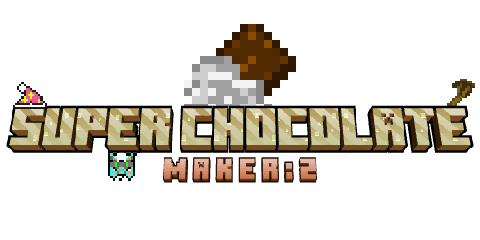

# SuperChocolateMaker2

A ported version of **SuperChocolateMaker** for **Minecraft 1.20.1 Forge**.

This mod expands Minecraft with a chocolate-themed energy system, ritual-based crafting, powerful curios accessories, and a variety of unique tools and blocks.

---

## ⚠️ Early Development

This mod is still in **early development stage**. Features may be incomplete, unbalanced, or subject to significant changes. **Back up your worlds** before using!

---

## ✨ Features

- **Chocolate Energy System** — A custom FE-compatible energy system powered by chocolate
- **Altar Ritual System** — 13 unlockable rituals using a 5×5 cross altar structure
- **Curios Accessories** — Flight Charm, Teleport Charm, Dimensional Shield, and more
- **Eternal Beacon** — Multi-effect beacon with overload mechanics
- **Chocolate Annihilation Generator** — FE power generation from chocolate fuel
- **Custom Effects** — Imaginary Pollution & Imaginary Resistance
- **Quality of Life Commands** — Teleport, night vision, unbreakable tool, and more

---

## 🔧 Dependencies

| Dependency | Required | Version |
|-----------|:--------:|---------|
| Minecraft Forge | ✅ | 1.20.1 (47+) |
| Curios API | ❌ (Recommended) | 5.14.1+ |
| JEI | ❌ (Recommended) | 15+ |
| Patchouli | ❌ | 1.20.1-84+ |

---

## 📥 Installation

1. Install **Minecraft Forge** for 1.20.1
2. Install **Curios API** (optional, recommended)
3. Download the latest `.jar` from [Releases](../../releases)
4. Place it in your `mods/` folder

---

## 🐛 Feedback & Issues

Found a bug or have a suggestion? Please [open an Issue](../../issues) — feedback is greatly appreciated!

---

## 📜 License

MIT License — see `mods.toml` for details.
